<div align="center">


# Swasthya Records
### **Autonomous AI Health Resource & Supply Chain Resilience Platform**

[](https://github.com/2007Talha/HealthGrid)
[-34A853?style=for-the-badge&logo=googlecloud&logoColor=white)](https://swasthya-records-727221214250.asia-south1.run.app)
[](https://cloud.google.com/vertex-ai)
[](https://developers.google.com/optimization)

<br/>

[](https://fastapi.tiangolo.com)
[](https://python.org)
[](https://react.dev)
[](https://www.typescriptlang.org)
[](https://vitejs.dev)
[](https://cloud.google.com/bigquery)
[](https://cloud.google.com/run)
[](LICENSE)

<br/>

> **"Predict demand spikes before shelves empty. Warn health officers 72 hours early. Rebalance medicines mathematically with zero donor risk. Empower leadership with grounded GenAI."**

<br/>

[🌐 **Open Live Cloud Run App**](https://swasthya-records-727221214250.asia-south1.run.app) • [🚀 Live Demo Walkthrough](#-judge-demonstration-walkthrough-3-minutes) • [✨ Core Features](#-core-features) • [🏗️ System Architecture](#️-system-architecture) • [🧠 AI Methodology](#-ai-approach--scientific-rigor) • [⚡ Quickstart Setup](#-local-setup--quickstart) • [🛡️ Security & Provenance](#-data-integrity--provenance)

---

</div>

<br/>

## 📌 Executive Summary

Across India's decentralized network of **30,000+ Primary Health Centres (PHCs)** and **Community Health Centres (CHCs)**, localized demand surges (such as post-monsoon dengue, malaria, and flood-borne diarrheal outbreaks) trigger catastrophic **$300\%\text{–}500\%$ spikes** in medication demand. 

While clinics in flood-hit districts exhaust vital supplies of ORS, IV fluids, and antibiotics, **neighboring facilities often sit on unutilized surplus stock**. Due to paper-based silos, rigid administrative boundaries, and manual logistics coordination, preventable stock-outs persist for days.

**Swasthya Records (SwasthyaGrid AI)** closes this visibility gap. Built for the **Google Cloud GenAI Hackathon 2026 (Track 3)**, it creates an autonomous digital twin of public healthcare supply chains that transforms fragmented data into predictive early warnings, optimal redistribution orders, and explainable AI-guided decision support.

```
┌────────────────────────────────────────────────────────────────────────────────────────┐
│                                 THE RESILIENCE LOOP                                    │
│                                                                                        │
│   📡 Real-Time Telemetry  ──►  📈 Multi-Horizon Forecast  ──►  ⚠️ Risk & Early Warning  │
│   (33 Sentinel Facilities)     (Ridge & LightGBM Models)      (DOSA < 3 Days Trigger)  │
│                                                                          │             │
│                                                                          ▼             │
│   🏁 Stock Runway Restored ◄──  🚚 OR-Tools Rebalancing  ◄──  🤖 Gemini 2.5 Copilot   │
│   (1.4 Days ➔ 14.2 Days)       (Min-Cost MILP Solver)         (Grounded Tool Calling)  │
└────────────────────────────────────────────────────────────────────────────────────────┘
```

---

## ⚡ The Challenge vs. The Swasthya Records Solution

| Challenge | Status Quo Healthcare Systems | With Swasthya Records |
| :--- | :--- | :--- |
| **Visibility** | Siloed monthly paper registers; zero inter-district sharing | **Real-time GIS telemetry** across 33 sentinel facilities with live stock runway tracking |
| **Forecasting** | Reactive ordering only after shelves empty | **7-day & 14-day multi-horizon AI projections** factoring in seasonal outbreaks and OPD trends |
| **Redistribution** | Manual bureaucratic phone calls taking 3–7 days | **Google OR-Tools MILP optimization** computing safe transfer pairs in milliseconds |
| **Donor Safety** | Donors risk stock-outs by over-supplying | **Strict 7-day safety stock safeguard** prevents any facility from being depleted |
| **Decision Support**| Static spreadsheets with no contextual reasoning | **Gemini 2.5 Flash Operations Copilot** with 10+ deterministic Python tools and voice input |
| **Readiness** | No pre-disaster simulation capability | **Interactive What-If Sandbox** (+30% demand spikes, transit delays, emergency shipments) |

---

## ✨ Core Features

<div align="center">

| Feature | Description | Tech Component |
| :--- | :--- | :--- |
| **🗺️ National Command Center** | Real-time Leaflet GIS mapping with live color-coded facility vulnerability status across Bihar, UP, and Maharashtra. | `React 19` + `Leaflet GIS` |
| **📈 Multi-Horizon AI Forecasting** | Machine-learning models forecasting medicine demand over 7- and 14-day horizons with seasonal anomaly weights. | `Ridge Regression` + `LightGBM` |
| **⚠️ Risk Intelligence Engine** | Automated classification of stock runways using Days of Stock Available ($DOSA$). Triggers alerts 72 hours early. | Mathematical Scoring Engine |
| **🚚 Google OR-Tools Optimizer** | Mixed-Integer Linear Programming (MILP) solving donor-recipient matching under road distance ($\le 50\text{ km}$) and safety stock constraints. | `Google OR-Tools 9.9+` |
| **🤖 Gemini 2.5 Operations Copilot** | Conversational assistant grounded in live operational databases via 10+ deterministic backend tool declarations. | `Gemini 2.5 Flash` + Function Calling |
| **🧪 What-If Scenario Sandbox** | Dynamic stress-testing sandbox evaluating sudden disease outbreaks, monsoon flash floods, and supply delays. | Interactive Simulation Engine |
| **🌐 Bilingual Localization** | Instant, zero-latency toggle between **English** and **हिन्दी (Hindi)** across all navigation, KPI cards, charts, and alerts. | `i18n Context Engine` |
| **🔒 Role-Based Access Control** | Least-privilege views for `ADMIN` (National Director), `STATE_OPERATOR` (State Director), and `DISTRICT_OPERATOR` (Nodal Officer). | `FastAPI Security` + JWT/RBAC |
| **🎬 1-Click Guided Demo Flow** | Automated 7-step guided scenario demonstrating baseline $\to$ flood disaster $\to$ alert $\to$ Copilot analysis $\to$ rebalancing. | `/demo` Guided Interactive Tour |
| **📊 Public Data Provenance Page** | Full transparency view attributing official data sources (MoHFW RHS, HMIS, NLEM) and simulation boundaries. | `/data-sources` Route |

</div>

---

## 🏗️ System Architecture

```text
                                  INTERNET / CLIENT BROWSER
                                              │
                                              ▼
                                Google Cloud Run (asia-south1)
                             Swasthya Records Web Application
                                              │
                    ┌─────────────────────────┼─────────────────────────┐
                    ▼                         ▼                         ▼
         Frontend Presentation           FastAPI Gateway         Vertex AI Engine
          React 19 + TypeScript        (REST + RBAC + Audit)     Gemini 2.5 Flash
          (Tailwind + Leaflet)         Asynchronous Python       (Operations Copilot)
                    │                         │                         │
                    │                         ▼                         │
                    │           ┌─────────────┴─────────────┐           │
                    │           ▼                           ▼           │
                    │     Google BigQuery               SQLite DB       │
                    │   (Government DW OLAP)        (Operational Twin)  │
                    │           │                           │           │
                    │           ▼                           ▼           │
                    │    Predictive ML               OR-Tools MILP      │
                    │  (Ridge / LightGBM)         (Supply Rebalancer)   │
                    │           │                           │           │
                    └───────────┴─────────────┬─────────────┴───────────┘
                                              ▼
                                Official Data Provenance
                       MoHFW RHS 2022 • HMIS 2022-23 • NLEM 2022
```

### End-to-End Data Pipeline Flow

```mermaid
flowchart LR
    A[🏥 Sentinel Health Facilities] -->|Telemetry / Footfall| B[⚡ FastAPI Gateway]
    B -->|Persist State| C[(Operational DB & BigQuery)]
    C -->|Feature Engineering| D[📈 ML Forecasting: Ridge / LightGBM]
    D -->|Demand Projections| E[⚠️ Risk Engine: DOSA Calculation]
    E -->|Shortage Detected| F[🚚 Google OR-Tools: MILP Optimizer]
    F -->|Optimal Transfer Route| G[🤖 Gemini 2.5 Flash Copilot]
    G -->|Explainable Actionable Plan| H[👨‍⚕️ Health Director / Nodal Officer]
    H -->|1-Click Approval| I[✅ Route Execution & Runway Restored]
```



---

## 🧠 AI Approach & Scientific Rigor

Swasthya Records pairs **deterministic mathematical guarantees** with **explainable generative intelligence**:

```
                                ┌──────────────────────────────────────────────┐
                                │        FOUR PILLARS OF SWASTHYA AI           │
                                └──────────────────────────────────────────────┘
                                                       │
         ┌─────────────────────────┬───────────────────┴─────────────────┬─────────────────────────┐
         ▼                         ▼                                     ▼                         ▼
 1. PREDICTIVE AI          2. RISK INTELLIGENCE                  3. OPTIMIZATION           4. GROUNDED GENAI
 ─────────────────         ─────────────────────                 ───────────────           ─────────────────
 Ridge & LightGBM          Mathematical Runway                   Google OR-Tools           Gemini 2.5 Flash
 Multi-horizon (7/14d)     DOSA = Stock / Demand                 MILP Solver               10+ Deterministic Tools
 Seasonality & OPD lags    Critical Alert if DOSA < 3.0d         Donor Safety Stock >= 7d  Hallucination-free Copilot
```

### 1. Multi-Horizon Predictive ML
* **Models**: Ridge Regression and LightGBM models trained on historical outpatient department (OPD) footfall, weekly epidemiologic cycles, and monsoon disaster factors.
* **Features**: Moving averages (7d, 14d), 7-day lagged consumption, day-of-week indicators, and disease multiplier curves.
* **Output**: Accurate 7-day and 14-day expected consumption curves per facility and medicine.

### 2. Risk Intelligence Engine
* Evaluates **Days of Stock Available ($DOSA$)**:
  $$\text{DOSA} = \frac{\text{Current Inventory Units}}{\text{Forecasted Daily Demand}}$$
* **Classification Tiers**:
  * 🔴 **CRITICAL** ($\text{DOSA} < 3.0\text{ days}$): Immediate stock-out risk; automated high-priority alert generated.
  * 🟡 **WARNING** ($3.0 \le \text{DOSA} < 7.0\text{ days}$): Emerging vulnerability requiring observation.
  * 🟢 **ADEQUATE** ($7.0 \le \text{DOSA} \le 30.0\text{ days}$): Balanced inventory runway.
  * 🔵 **SURPLUS** ($\text{DOSA} > 30.0\text{ days}$): Eligible candidate donor for rebalancing.

### 3. Google OR-Tools Combinatorial Rebalancing
* Formulated as a **Mixed-Integer Linear Program (MILP)** minimizing total logistics cost and transit distance while rebalancing inventory:
  $$\min \sum_{i \in \text{Donors}} \sum_{j \in \text{Recipients}} c_{ij} \cdot x_{ij}$$
* **Strict Constraints**:
  * **Donor Safety Buffer**: A donor facility must retain at least **7.0 days of safety stock** after any transfer:
    $$\text{Stock}_i - \sum_j x_{ij} \ge 7.0 \times \text{DailyDemand}_i$$
  * **Distance Threshold**: Maximum transfer radius is strictly capped at **50 km** for rapid rural road dispatch.
  * **Deficit Coverage**: Cannot transfer more than the recipient's validated shortfall.

### 4. Grounded Generative Copilot (Gemini 2.5 Flash)
* **Zero Hallucination Guarantee**: Gemini does not speculate on inventory numbers. It is equipped with **10+ deterministic Python tool functions** via Vertex AI function calling (`get_facility_status`, `calculate_stock_risk`, `recommend_redistribution`, `run_what_if_simulation`).
* **Auditable Reasoning**: Every clinical or supply recommendation references exact database entity IDs, computed DOSA values, and verified transit times.

---

## 🏆 Judge Demonstration Walkthrough (3 Minutes)

Experience the full emergency resilience lifecycle interactively at `/demo`:

| Step | Phase | What Happens | AI Engine | Outcome / Impact |
| :---: | :--- | :--- | :--- | :--- |
| **1** | **Normal Baseline** | 33 sentinel facilities across Bihar, UP, and Maharashtra operate with balanced inventory. | Telemetry Monitor | National readiness score: **94%**; all facilities green. |
| **2** | **Disaster Surge** | User triggers a **Monsoon Flood Surge** in Patna District (+40% diarrheal & trauma demand). | Simulation Engine | Acute footfall spike injected into operational twin. |
| **3** | **Demand Spike** | Machine learning models detect rapid inventory burn for ORS and Paracetamol. | `LightGBM / Ridge` | 7-day consumption forecast surges by **+420%**. |
| **4** | **Early Warning** | System raises high-priority alerts: Patna Sadar PHC will run out of ORS in **1.4 days**. | Risk Engine | Alert triggered **72 hours before actual stock-out**. |
| **5** | **Copilot Analysis** | Ask Gemini Copilot: *"What is the risk at Patna Sadar and how can we mitigate it?"* | `Gemini 2.5 Flash` | Gemini calls tool functions, confirms shortfall, and explains drivers. |
| **6** | **OR-Tools Rebalancing** | Run optimizer to find donor. Danapur Clinic is selected (200 units, 18 km transit). | `Google OR-Tools` | Donor retains 8.5 days of safety stock; transfer verified safe. |
| **7** | **Simulate & Approve** | Health Director reviews and approves the transfer order with one click. | State Transition | Patna Sadar runway restored from **1.4 ➔ 14.2 days**! |

---

## 📊 Data Integrity & Provenance

Swasthya Records maintains strict separation between official public government records and prototype operational simulations:

```
┌────────────────────────────────────────────────────────────────────────────────────────┐
│                                 DATA ARCHITECTURE                                      │
├──────────────────────────────────────────┬─────────────────────────────────────────────┤
│  🏛️ OFFICIAL GOVERNMENT BASELINES         │  🧪 SIMULATED OPERATIONAL DIGITAL TWIN      │
│  (Real Public Data via BigQuery)         │  (Prototype Demonstration Layer)            │
├──────────────────────────────────────────┼─────────────────────────────────────────────┤
│  • Rural Health Statistics (RHS) 2022    │  • Daily medicine dispensing telemetry      │
│  • Health Management Information System  │  • Real-time stock burn and footfall curves │
│  • National List of Essential Medicines  │  • Monsoon flood demand surge triggers      │
│  • Census of India Demographics          │  • Synthetic transit delivery updates       │
└──────────────────────────────────────────┴─────────────────────────────────────────────┘
```

| Dataset | Publisher | Source Type | Coverage | Usage in Platform |
| :--- | :--- | :--- | :--- | :--- |
| **Rural Health Statistics (RHS) 2022** | MoHFW, Govt of India | Official Public | 36 States & UTs | Facility registry, bed counts, geographic coordinates |
| **HMIS 2022–2023** | NHM, MoHFW | Official Public | District aggregates | Patient footfall and bed occupancy baselines |
| **National List of Essential Medicines (NLEM 2022)** | Dept of Pharmaceuticals / CDSCO | Government Formulary | 384 formulations | 20 tracked essential therapeutic medicines & pack sizes |
| **Census of India** | Ministry of Home Affairs | Official Demographics | National | Population distributions and transit distances |
| **Operational Digital Twin** | Swasthya Records Simulator | Prototype Simulation | 33 Sentinel Clinics | Daily inventory consumption and emergency flood surges |

> [!NOTE]
> All public datasets are queryable transparently within the platform at the [`/data-sources`](http://localhost:5173/data-sources) page.

---

## ☁️ Google Cloud Platform Integration

| GCP Service | Role in Platform | Implementation Detail |
| :--- | :--- | :--- |
| **Google Cloud Run** | Serverless Container Hosting | Runs containerized FastAPI backend and React frontend with non-root security context and auto-scaling (`asia-south1`). |
| **Vertex AI / Gemini 2.5 Flash** | GenAI Operations Copilot | Powers natural language decision support with structured tool declarations and What-If scenario explanation. |
| **Google BigQuery** | Enterprise Data Warehouse | Stores official RHS, HMIS, and NLEM tables (`arcadeaiagent.swasthyagrid`) for analytics and baselining. |
| **Google OR-Tools** | Mathematical Optimization | Industrial-strength Mixed-Integer Linear Programming solver computing rebalancing transfers. |
| **Artifact Registry** | Container Image Management | Secure Docker container repository hosted in Mumbai region (`asia-south1`). |

### 🌐 Live Production Deployment

> **Primary Service URL**: [https://swasthya-records-727221214250.asia-south1.run.app](https://swasthya-records-727221214250.asia-south1.run.app)  
> **Interactive Swagger API Docs**: [https://swasthya-records-727221214250.asia-south1.run.app/docs](https://swasthya-records-727221214250.asia-south1.run.app/docs)  
> **Health Probe Endpoint**: [https://swasthya-records-727221214250.asia-south1.run.app/health](https://swasthya-records-727221214250.asia-south1.run.app/health)  
> **GCP Project**: `arcadeaiagent` | **Region**: `asia-south1` (Mumbai)

To deploy or update to Google Cloud Run in one command:
```bash
gcloud run deploy swasthya-records --source . --region asia-south1 --allow-unauthenticated
```

---

## ⚡ Local Setup & Quickstart

### Prerequisites
* **Python 3.11+**
* **Node.js 18+** & **npm**
* **Git**

### 1. Clone Repository
```bash
git clone https://github.com/2007Talha/HealthGrid.git
cd HealthGrid
```

### 2. Configure Environment Variables
Copy the sample environment configuration file:
```bash
cp .env.example .env
```
*(Default settings work out-of-the-box in offline/development mode)*

### 3. Backend Setup

<details open>
<summary><b>Windows (PowerShell)</b></summary>

```powershell
python -m venv venv
.\venv\Scripts\Activate.ps1
pip install -r requirements.txt
python -m uvicorn backend.app.main:app --host 127.0.0.1 --port 8000 --reload
```
</details>

<details>
<summary><b>Linux / macOS (Bash)</b></summary>

```bash
python3 -m venv venv
source venv/bin/activate
pip install -r requirements.txt
python3 -m uvicorn backend.app.main:app --host 127.0.0.1 --port 8000 --reload
```
</details>

### 4. Frontend Setup

In a new terminal window:
```bash
cd frontend
npm install
npm run dev
```

Open your browser at **`http://localhost:5173/`**.

---

## 🐳 Docker Deployment

Run the complete platform with a single command via Docker Compose:

```bash
docker-compose up --build
```

Access the unified containerized application at `http://localhost:8000/`.

---

## 🔌 Core API Endpoints

<details>
<summary><b>Click to expand API reference table</b></summary>

| Endpoint | Method | Description | Role Required |
| :--- | :---: | :--- | :--- |
| `/api/facilities` | `GET` | List all 33 sentinel facilities with live telemetry | Public / Any |
| `/api/facilities/{id}` | `GET` | Retrieve detailed telemetry, beds, and stock for a facility | Public / Any |
| `/api/medicines` | `GET` | List tracked essential therapeutic medicines (NLEM 2022) | Public / Any |
| `/api/forecasts` | `GET` | Multi-horizon (7d/14d) ML demand and stock-out predictions | `DISTRICT_OPERATOR`+ |
| `/api/alerts` | `GET` | Active stock-out and bed saturation early warning alerts | `DISTRICT_OPERATOR`+ |
| `/api/rebalancing/optimize`| `POST` | Execute Google OR-Tools MILP logistics optimization | `STATE_OPERATOR`+ |
| `/api/rebalancing/orders` | `GET` | List active, transit, and completed transfer orders | `STATE_OPERATOR`+ |
| `/api/copilot/chat` | `POST` | Query Gemini 2.5 Flash Grounded Operations Copilot | `STATE_OPERATOR`+ |
| `/api/simulations/what-if` | `POST` | Run shadow simulation of demand shocks and transit delays | `ADMIN` |
| `/api/health` | `GET` | Health check endpoint returning backend and engine status | Public |

</details>

---

## 🔒 Security, Compliance & Responsible AI

* **Role-Based Access Control (RBAC)**: Strict least-privilege scoping across `ADMIN`, `STATE_OPERATOR`, and `DISTRICT_OPERATOR`. Unauthorized cross-state queries are rejected with **HTTP 403 Forbidden**.
* **Sliding-Window Rate Limiting**: In-memory rate limiting shields endpoints against denial of service (**HTTP 429 Too Many Requests**).
* **Anti-Hallucination Guardrails**: Regex registry validation and deterministic tool calling prevent Gemini from hallucinating non-existent facilities or fabricated medicines.
* **Privacy by Design**: No patient Personally Identifiable Information (PII) is collected, stored, or processed. All telemetry represents aggregate facility-level capacity.
* **Structured Observability**: Structured JSON logging with `X-Request-ID` tracing across every request for compliance auditability.

---

## 🗺️ Roadmap & Real-World Integration

- [x] **Phase 1 (Hackathon MVP)**: Multi-horizon ML forecasting, Google OR-Tools MILP rebalancer, Gemini 2.5 Flash Grounded Copilot, bilingual UI, and interactive judge tour.
- [ ] **Phase 2 (Government Systems Integration)**: Integration with state **e-Aushadhi** and **DVDMS** inventory portals using Ayushman Bharat Digital Mission (**ABDM**) standards.
- [ ] **Phase 3 (IoT Cold-Chain Telemetry)**: Ingestion of live BLE/LoRaWAN temperature sensors for vaccine and insulin storage cold-boxes.
- [ ] **Phase 4 (Live Traffic & Google Maps)**: Real-time route optimization factoring in live monsoon road closures via Google Maps Distance Matrix API.

---

## ⚖️ Disclaimers

> [!CAUTION]
> **Data Disclaimer**: Swasthya Records is an experimental decision-support platform built for demonstration in the Google Cloud GenAI Hackathon 2026. Official government datasets (RHS, HMIS, NLEM) provide structural baselines, while dynamic inventory dispensing and emergency conditions are simulated. It does not execute live physical logistics.

> [!IMPORTANT]
> **AI Disclaimer**: AI-generated predictions, risk rankings, and redistribution suggestions are decision-support aids designed to augment human judgment and must be verified by authorized nodal medical officers before execution.

---

<div align="center">

### 💡 Google Cloud GenAI Hackathon 2026
**Track 3: Smart Health & Supply Chain Resilience**  
*GCP Project ID: `arcadeaiagent` | Region: `asia-south1` (Mumbai)*

**Repository**: [github.com/2007Talha/HealthGrid](https://github.com/2007Talha/HealthGrid)

<br/>

*“Turning fragmented healthcare signals into an autonomous early-warning and response grid.”*

</div>
