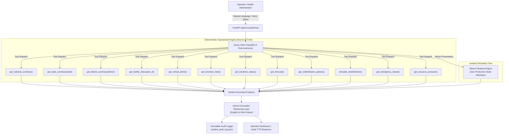

# SwasthyaGrid AI — Phase 5: Gemini Operations Copilot Architecture

## Executive Summary
The **SwasthyaGrid Copilot** (`SwasthyaGrid AI Assistant`) is a specialized operational intelligence agent built for public health administrators, state resource directors, and district chief medical officers. It bridges complex predictive time-series models, stock-out risk evaluators, and Mixed Integer Linear Programming (MILP) redistribution engines with an intuitive natural-language and voice interface.

---

## Architectural Principles & Strict Guardrails

### Core Non-Negotiable Guardrails
1. **Gemini is the Reasoning & NL Layer, NOT the Data Store**: All numerical facts, stock quantities, DOSA days, beds, and transfers originate strictly from deterministic backend microservices.
2. **Zero Hallucination Policy**: If data for a facility or medicine is missing, the Copilot explicitly responds: *"There is insufficient evidence to determine this reliably."*
3. **Simulation vs Reality Demarcation**: What-If scenarios and redistribution simulations are explicitly tagged with `WHAT-IF SIMULATION (Isolated Shadow Test - No State Modified)` to ensure operators never confuse recommendations with executed logistics.
4. **Role-Based Access Control**: Strict access boundaries ensure District Operators cannot view cross-state restricted operational data without elevated privileges.
