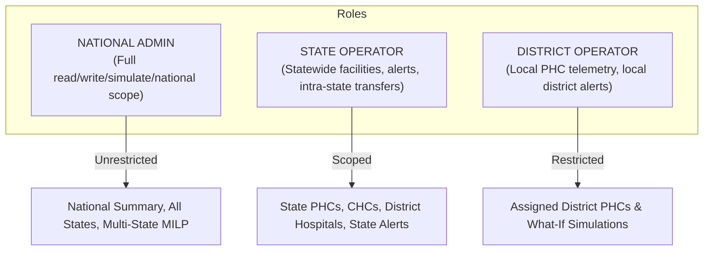

# Swasthya Records — Security, Access Control & System Guardrails

**Product**: **Swasthya Records** (`SwasthyaGrid AI`)  
**Subtitle**: **AI-Powered Health Resource & Supply Chain Resilience Platform**  
**Tagline**: **Predict. Warn. Redistribute. Respond.**  

---

## 1. Role-Based Access Hierarchy (RBAC)

Swasthya Records enforces strict least-privilege scoping across administrative boundaries:



---

## 2. Authorization Scoping Matrix

| Role | Scope | National View | What-If Simulations | Redistribution Triggers | Cross-Region Access |
| :--- | :--- | :--- | :--- | :--- | :--- |
| **`ADMIN`** | All Indian States & UTs | ✅ Full Access | ✅ Unrestricted | ✅ Full Authorization | ✅ Allowed |
| **`STATE_OPERATOR`** | Assigned State (e.g., Bihar `IN-BR`) | ❌ Scoped to State | ✅ State Facilities | ✅ Intra-State Rebalancing | ❌ **403 Forbidden** |
| **`DISTRICT_OPERATOR`**| Assigned District (e.g., Patna `IN-BR-PAT`) | ❌ Restricted | ✅ Local Facilities | ❌ Read-Only Decision Support | ❌ **403 Forbidden** |

---

## 3. Rate Limiting & Abuse Prevention

* **Mechanism**: In-memory sliding-window rate limiter implemented in `backend/app/core/rate_limit.py`.
* **Target Endpoints**:
  - `/api/v1/copilot/chat`
  - `/api/v1/copilot/what-if`
  - `/api/v1/copilot/voice`
  - `/api/v1/redistribution/recommend`
  - `/api/v1/redistribution/simulate`
* **Response**: Exceeding the rate limit returns **HTTP 429 Too Many Requests** with `Retry-After` header and sanitized JSON error body.

---

## 4. Structured Observability & Audit Logging

* **Request Tracing**: Injects a unique `X-Request-ID` UUID header into every HTTP response.
* **Log Schema**: Every incoming request and outbound response is recorded as a structured JSON object:
  ```json
  {
    "timestamp": "2026-09-10T15:35:10.123456Z",
    "request_id": "7b8f9e21-3a45-4c67-8d9e-1a2b3c4d5e6f",
    "method": "POST",
    "endpoint": "/api/v1/copilot/chat",
    "status_code": 200,
    "latency_ms": 142.5,
    "user_role": "ADMIN",
    "user_region": "National"
  }
  ```
* **Credential Masking**: Authentication tokens, authorization headers, passwords, and private parameters are automatically stripped before log serialization.

---

## 5. Ethical AI Guardrails & Hallucination Defense

1. **Registry Verification**: Regex parsers validate all facility identifiers. Non-existent IDs (e.g., `PHC-999999`) return an explicit "Facility ID not found in registry" message, preventing fabricated inventory records.
2. **Deterministic Tool Grounding**: Gemini 2.5 Flash only formats and explains real evidence retrieved via deterministic Python backend functions.
3. **Data Anonymization**: No patient Personally Identifiable Information (PII) is stored or processed. All telemetry represents aggregated clinic counts and medicine formulations.
4. **Mandatory Disclaimers**: Displayed prominently across the user interface:
   - **Data Disclaimer**: Confirms prototype operational data is simulated for demonstration.
   - **AI Disclaimer**: Recommends human health officer sign-off before operational action.

