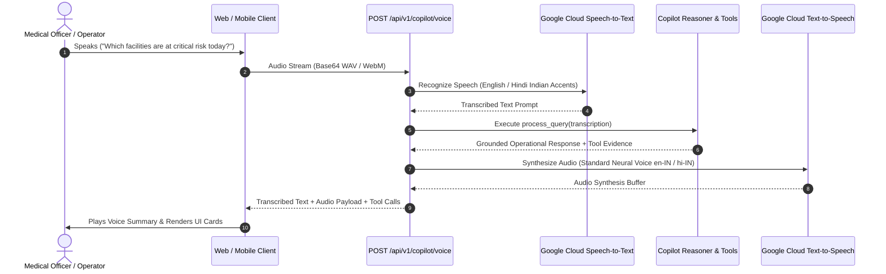

# SwasthyaGrid Copilot — Voice & Speech Architecture

## Overview
Field medical officers and on-duty PHC pharmacists often operate in hands-busy environments (clinics, cold-storage facilities, emergency disaster zones). The SwasthyaGrid voice pipeline enables seamless audio-in, audio-out operational intelligence.

---

## Technical Pipeline

---

## Low-Latency Design
- **Sampling**: 16kHz linear PCM / Opus encoding for high accuracy over cellular 4G/5G connections.
- **Language Models**: Configured for Indian English (`en-IN`) and Hindi (`hi-IN`) accents and regional healthcare terminology (e.g. "Paracetamol", "Amoxicillin", "PHC Bakhtiyarpur", "District Hospital").
- **Voice Response Available**: All API responses provide `audio_response_available: true` flags for immediate playback in the UI.
